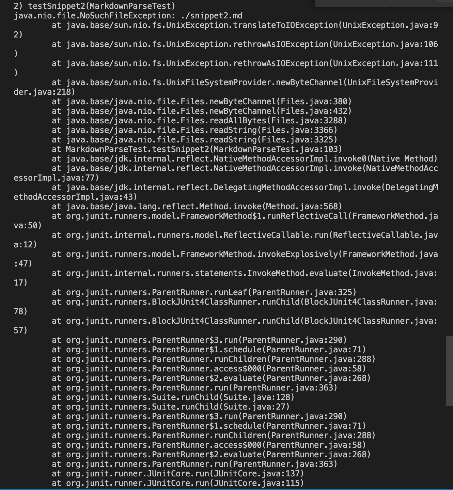

* [Link to my repo](https://github.com/Yumei0422/CSE15L-TheLunaMoths)

  [Link to the group I have review](https://github.com/yaz067/markdown-parse/blob/main/MarkdownParseTest.java)


* The test code in MarkdownParseTest.java I used for both testing my implementation and the other group's implementation 

```
    @Test
    public void testSnippet1() throws IOException{
        Path fileName = Path.of("./snippet1.md");
	    String contents = Files.readString(fileName);
        List<String> expect = List.of("`google.com","google.com","ucsd.edu");
        assertEquals(expect,MarkdownParse.getLinks(contents));
    }

    @Test
    public void testSnippet2() throws IOException{
        Path fileName = Path.of("./snippet2.md");
	    String contents = Files.readString(fileName);
        List<String> expect = List.of("a.com","a.com(())","example.com"); 
        assertEquals(expect,MarkdownParse.getLinks(contents));
    } 

    @Test
    public void testSnippet3() throws IOException{
        Path fileName = Path.of("./snippet3.md");
	    String contents = Files.readString(fileName);
        List<String> expect = List.of("https://ucsd-cse15l-w22.github.io/");
        assertEquals(expect,MarkdownParse.getLinks(contents));
    }
    
 ```   
* All 3 of the test fails for my program and this shows where it fails

```
1) testSnippet1(MarkdownParseTest)
java.lang.AssertionError: expected:<[`google.com, google.com, ucsd.edu]> but was:<[url.com, `google.com, google.com]>

2) testSnippet2(MarkdownParseTest)
java.lang.AssertionError: expected:<[a.com, a.com(()), example.com]> but was:<[a.com, a.com((]>

3) testSnippet3(MarkdownParseTest)
java.lang.AssertionError: expected:<[https://ucsd-cse15l-w22.github.io/]> but was:<[]>

```




* All 3 of the test fails for the other group's program and this shows where it fails

```
1) testSnippet1(MarkdownParseTest)
java.lang.AssertionError: expected:<[`google.com, google.com, ucsd.edu]> but was:<[url.com, `google.com, google.com, ucsd.edu]>

2) testSnippet2(MarkdownParseTest)
java.lang.AssertionError: expected:<[`google.com, google.com, ucsd.edu]> but was:<[a.com, a.com((, example.com]>

3) testSnippet3(MarkdownParseTest)
java.lang.AssertionError: expected:<[b.com, a.com(()), example.com]> but was:<[
    https://www.twitter.com
, 
    https://ucsd-cse15l-w22.github.io/
, github.com

And there's still some more text after that.

[this link doesn't have a closing parenthesis for a while](https://cse.ucsd.edu/


]>
```


* For snippet 1, I think the problem can be fixed in less than 10 lines as the only place that the backtip is causing a problem is when there's a backtick before the first open bracket. We can probably add a statement to check if there's a backtip before the variable "nextOpenBracket". If yes, we don't add the link to the variable toReturn.
* For snippet 2, our group's code was able to recognize the nested link, but can't pass if there's nestd brackets, and escaped brackets. This case might be trickier to be all checked in under 10 lines since there's many cases to consider and we might have to write an if statement for each condition nested bracket and escaped brackets condition. 
* For snippet 3, the code for our group returns nothing instad of the github io link. Since the code snippet involves newlines in brackets and parentheses, I don't think we are able to fix the problem in under 10 lines since our program is only checking for if there's a single spaces between parentheses. It's hard to determine how many spaces are used for a new line so I don't think there's an easy way to do it. 
